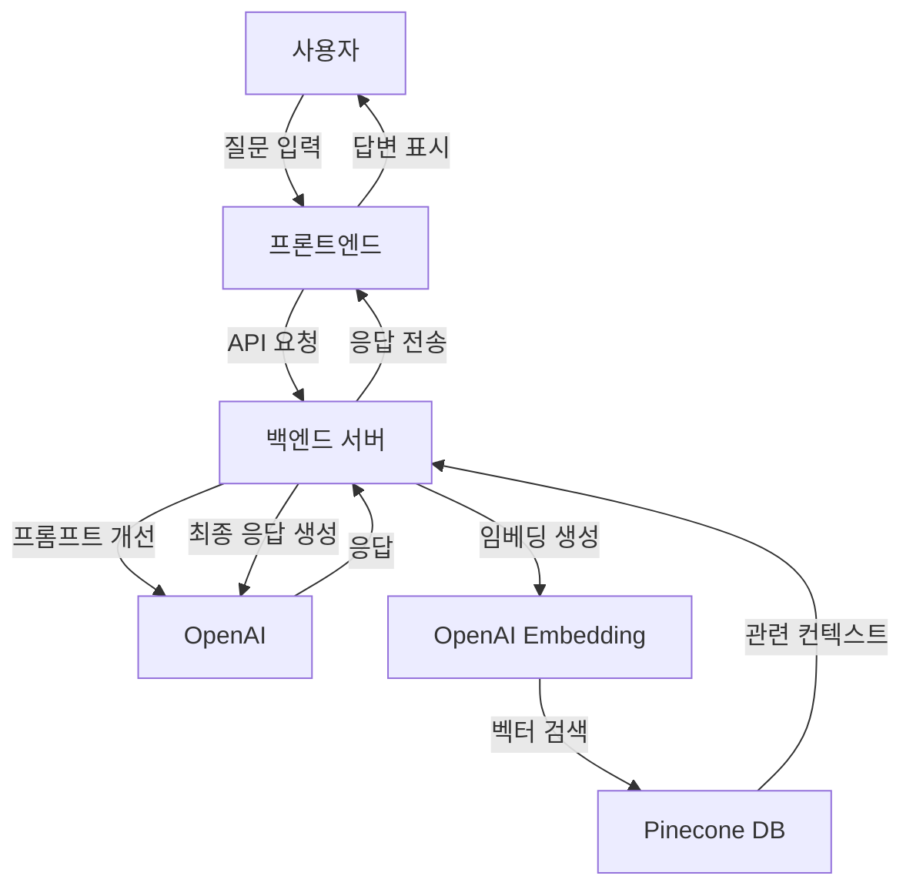

  

<h1 align="center">🤖 INNOMAX AI HELPER</h1>

기업 맞춤형 RAG 기반 챗봇 시스템

  
  
  
  

  <a href="#프로젝트-소개">프로젝트 소개</a> •
  <a href="#핵심-기술-및-특징">핵심 기술</a> •
  <a href="#기술-스택">기술 스택</a> •
  <a href="#구현-세부-사항">구현 세부 사항</a> •
  <a href="#활용-분야">활용 분야</a> •
  <a href="#확장-계획">확장 계획</a>

<!-- 여기에 데모 GIF 또는 스크린샷 추가 -->

  

## 프로젝트 소개

> 이 프로젝트는 이노맥스(INNOMAX) 회사를 위한 맞춤형 AI 챗봇 시스템으로, 최신 RAG(Retrieval-Augmented Generation) 기술을 활용하여 개발되었습니다.

이 챗봇은 회사 내부 지식과 장비 정보를 효과적으로 검색하고 정확한 답변을 제공하여 직원들과 고객사 사용자들의 질문에 신속하게 대응할 수 있습니다.

## 📋 목차

- [프로젝트 소개](#프로젝트-소개)
- [핵심 기술 및 특징](#핵심-기술-및-특징)
- [기술 스택](#기술-스택)
- [구현 세부 사항](#구현-세부-사항)
- [활용 분야](#활용-분야)
- [확장 계획](#확장-계획)
- [설치 및 실행 방법](#설치-및-실행-방법)

## 🚀 핵심 기술 및 특징

### 🔍 RAG(Retrieval-Augmented Generation) 시스템 구현
- 사용자 질문에 대해 관련성 높은 문서를 검색한 후 AI가 정확한 답변 생성
- 벡터 검색 기반의 정보 검색으로 기존 키워드 검색보다 의미론적으로 관련성 높은 결과 제공
- 회사 특화 데이터를 활용한 맞춤형 응답 생성

### 🧩 최적화된 데이터 처리 파이프라인
- 전문적인 청킹(Chunking) 모델을 사용하여 문서를 의미 단위로 분할
- 문맥을 유지하면서도 검색 효율성을 높이는 최적화된 청킹 전략 적용
- 데이터의 특성과 질문 패턴을 고려한 맞춤형 데이터 전처리

### 📊 고성능 임베딩 모델 적용
- OpenAI의 `text-embedding-3-small` 모델을 사용하여 텍스트를 고차원 벡터로 변환
- 의미론적 유사성을 정확하게 캡처하는 고품질 임베딩 생성
- 효율적인 임베딩 처리로 빠른 검색 속도 구현

### 💾 Pinecone 벡터 데이터베이스 통합
- 확장성과 고성능을 제공하는 Pinecone 벡터 데이터베이스 활용
- 실시간 벡터 검색으로 밀리초 단위의 빠른 응답 제공
- 메타데이터 필터링을 통한 사용자 권한별 정보 접근 제어

### 🌐 다국어 지원 및 프롬프트 최적화
- 한국어, 영어, 일본어, 중국어 등 다국어 지원
- 사용자 질문을 벡터 검색에 최적화된 형태로 자동 변환하는 프롬프트 개선 시스템
- 사용자 의도를 정확히 파악하기 위한 2단계 질문 처리 프로세스

### 💻 사용자 친화적 인터페이스
- 직관적인 채팅 인터페이스 설계
- 장비군, 고객사, 질문 유형 등 필터 기능 제공
- 응답 로딩 상태 시각화 및 메시지 포맷팅 지원

## 🔧 기술 스택

| 분야 | 기술 |
|------|------|
| **프론트엔드** | HTML5, CSS3, JavaScript (ES6+) |
| **백엔드** | Node.js, Express.js |
| **AI 모델** | OpenAI GPT-4o-mini, text-embedding-3-small |
| **데이터베이스** | Pinecone 벡터 DB (서버리스) |
| **배포** | GitHub Pages, CloudType |

### 인프라
- GitHub 저장소: [AI_chatbot_forGroup](https://github.com/tgyeo/AI_chatbot_forGroup)
- 배포 URL: [https://tgyeo.github.io/AI_chatbot_forGroup/](https://tgyeo.github.io/AI_chatbot_forGroup/)
- 백엔드 API: [https://port-0-ai-chatbot-forgroup-m8bfjrmj2356a824.sel4.cloudtype.app](https://port-0-ai-chatbot-forgroup-m8bfjrmj2356a824.sel4.cloudtype.app)

## 🔎 구현 세부 사항

  
데이터 처리 파이프라인

  
  ### 데이터 처리 파이프라인
  1. 회사 내부 문서와 장비 매뉴얼 수집
  2. 전문 청킹 모델을 사용하여 의미 단위로 문서 분할
  3. text-embedding-3-small 모델로 각 청크를 고차원 벡터로 변환
  4. 메타데이터(접근 권한, 문서 유형, 관련 장비 등) 추가
  5. Pinecone 벡터 데이터베이스에 인덱싱 및 저장

  
사용자 질문 처리 흐름

  
  ### 사용자 질문 처리 흐름
  1. 사용자가 질문 입력 (장비군, 고객사, 질문 유형 선택 가능)
  2. 프롬프트 최적화 모듈이 질문을 벡터 검색에 적합한 형태로 변환
  3. 사용자에게 변환된 질문 확인 요청 (2단계 검증)
  4. 확인된 질문을 임베딩하여 Pinecone에서 관련 컨텍스트 검색
  5. 사용자 유형(이노맥스 직원/고객사 직원)에 따라 접근 가능한 정보 필터링
  6. 검색된 컨텍스트와 원본 질문을 바탕으로 GPT-4o-mini가 최종 응답 생성
  7. 포맷팅된 응답을 사용자에게 제공

  
보안 및 권한 관리

  
  ### 보안 및 권한 관리
  - 로그인 시스템을 통한 사용자 인증
  - 사용자 유형에 따른 정보 접근 제어 (이노맥스 직원/고객사 직원)
  - Pinecone 쿼리 시 메타데이터 필터링을 통한 보안 강화
  - 관리자 전용 데이터 관리 기능

## 📱 활용 분야

- 🔧 장비 관련 문제 해결 및 기술 지원
- 👨‍💼 신규 직원 온보딩 및 교육
- 🔍 내부 문서 및 지식 검색
- 👩‍💻 고객사 기술 지원 및 서비스
- 🌏 다국어 기술 문서 접근성 향상

## 📈 확장 계획

- 실시간 피드백 시스템 및 학습 데이터 수집 기능 추가
- 추가 언어 지원 확대
- 대시보드 및 분석 도구 통합
- 이미지 및 다중 모달 데이터 처리 기능 추가
- 챗봇 인터페이스의 모바일 앱 버전 개발

## 📋 시스템 아키텍처

## 🙏 감사의 말

이 프로젝트는 다음 기술과 서비스를 기반으로 합니다:
- [OpenAI](https://openai.com/)
- [Pinecone](https://www.pinecone.io/)
- [Node.js](https://nodejs.org/)
- [Express.js](https://expressjs.com/)

## 📄 라이센스

이 프로젝트는 MIT 라이센스 하에 배포됩니다. 자세한 내용은 [LICENSE](LICENSE) 파일을 참조하세요.